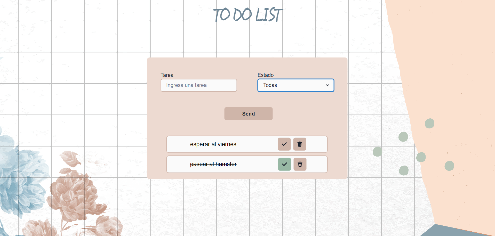

# **To Do List**

## The project

The objective of this project is to create an app that displays your to do daily tasks

 
    

## Structure of the application

### Parts

-To introduce your task input

This input will allow you to create your task. It will have to be a text between 4 and 25 characters

 
    

-State Input

This input will let you to select and filter between three states: completed, uncompleted and all the tasks

 
    

-To visualize your task Input

Finally here you could visualize your task, and be able to checked when you done it or eliminate with the bin button.

 
    

## In this project we used...

### React and Chakra UI

We practice React and Chakra UI with the project mentioned before

-   CSS Framework -> [Chakra-Iu] (https://chakra-ui.com/)

### Many thanks to Guille Montaña!!

 Project made by Lorena Avalos and Laura Marcelli for the ADA 18va comission 

